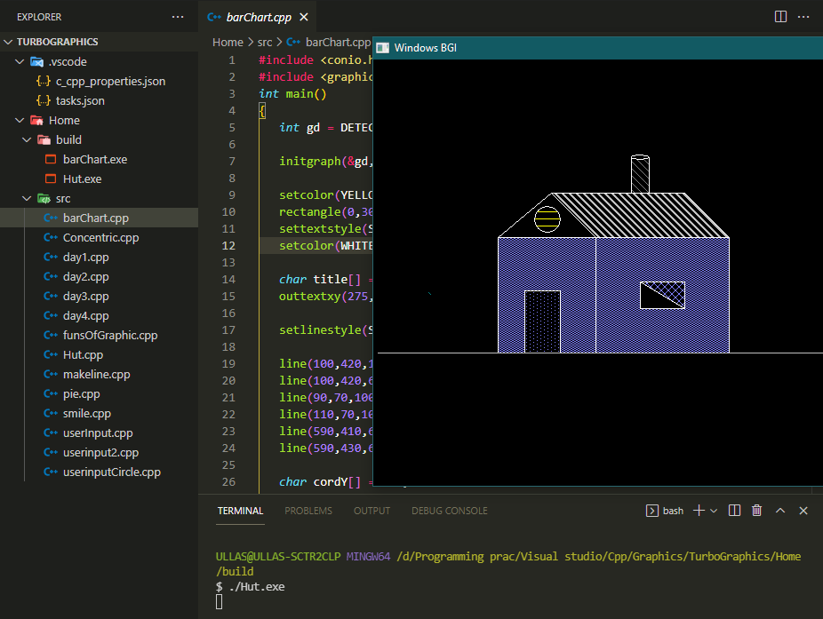

[](https://img.shields.io/badge/Auther---Ullas-blu?utm_source=github.com&utm_medium=campaign&utm_content=button&utm_campaign=dmhendricks%2Ffile-icon-vectors)

## Setting up graphics library (graphics.h) in Visual Studio Code (c++)

### Table Of Content: 

- [General info](#general-info)
- [files](#files)
- [Setup](#setup)
- [.vscode config file](https://github.com/ullaskunder3/graphics.h-setup)

My Workspace Dir And code example 

## General info
It like a tradition to use Turbo in our Indian CS sector.
Its because the syllabus haven't been changed since long time.

The graphics. h header file provides access to a simple graphics library that makes it possible to draw lines, rectangles, ovals, arcs, polygons, images, and strings on a graphical window. The second step is initialize the graphics drivers on the computer using initgraph method of graphics. h library.

- To know More [Stanford](https://web.stanford.edu/class/archive/cs/cs106b/cs106b.1126/materials/cppdoc/graphics.html) !!old

> <graphics.h> is very old library. It's better to use something that is new.
> There are much better option 

Allegro or SDL libraries may be for you.
You could also try SFML. It has quite a following. You'll have a large community behind you if you needed any help.

--------------------------------------------------

Now To set up graphics.h in vs code:
	
## files
- [Graphics](./graphics.h)
- [Winbgim](./winbgim.h)
- [libbgi](./libbgi.a)

	
## Setup
 Get all the files needed `graphics.h`, `winbgim.h` and `libbgi.a`
 
 If you dont have MinGW install it from official and follow the steps.<br>
 Know the difference between MINGW, Mingw-w64 && TDM [learn more go, go, go...](https://github.com/ullaskunder3/cpp-setup-vsCode#setup)
 
- Copy `graphics.h` and `winbgim.h` files to MinGW/`include` folder. 
   Location Might be **("C:\MinGW\include\")**
- Copy `libbgi.a` to file to MinGW/`lib` folder. 
   Location **("C:\MinGW\lib\")**
- Create or Add `.vscode` folder in that workspace which will contain `task.json`, `c_cpp_properties.json` you can get it from the [.vscode config](https://github.com/ullaskunder3/graphics.h-project-template)
- 
   
 Open Vs Code Smart way:
   - Select a folder and open Terminal
   ```bash
   mkdir testFolder
   cd testFolder
   code .
   ```


```cpp
    //create a file name it (example.cpp)

    #include <graphics.h> 
      int main()
      {
          int gd = DETECT, gm;
          char data[] = "C:\\MinGW\\lib\\libbgi.a";
      
          initgraph(&gd, &gm, data);
	  //you can also do NULL for third parameter if you did above setup successfully
	  //example: initgraph(&gd, &gm, NULL);
          circle(200, 200, 100);
          getch();
          closegraph();
          return 0;
      }
  ```
 Running the file using command in termainl: 
  ```cmd
       g++ -o testfile example.cpp -lbgi -lgdi32 -lcomdlg32 -luuid -loleaut32 -lole32

      //after u'll get textFile.exe run using command: .\testFile
  ```
  Easy run template for graphics.h [repo](https://github.com/ullaskunder3/graphics.h-project-template)
  If your dont want to write that command again and again you can create [task.json](https://github.com/ullaskunder3/graphics.h-setup/tree/main/.vscode)
